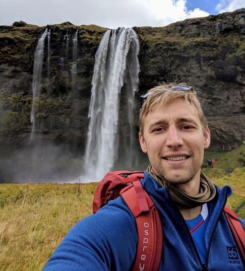

  
  
Aside
====================================
  
  

Contact info 
------------------------------------
  
<i class="fa fa-envelope"></i> jordanckrogmann@gmail.com  

<i class="fa fa-github"></i> github.com/Jordan-Krogmann
  
<i class="fa fa-phone"></i> (254) 702-7244

Skills 
------------------------------------
  
- <i class="fa fa-empire"></i> Proficient in R, Python, SQL, SSIS, LaTex, Rmarkdown, Jupyter Notebooks, Git, Microsoft Azure, Data Bricks, AWS, and Sagemaker

- <i class="fa fa-resistance"></i> Experienced with developing & managing high performance teams, advanced tasks in statistical/machine learning functions, data analysis, and data architecture

Disclaimer
------------------------------------

Main
====================================

Jordan Krogmann {#title}
------------------------------------

Experienced Data Scientist with a demonstrated history of working in the higher education industry and executing growth methodologies to improve business models.

Professional Experience {data-icon=briefcase}
------------------------------------

### AVP of Analytics & Data Science

University of Arizona

Tucson AZ

Current - Apr 2023

- Built and restructured a comprehensive data warehouse to serve as the university’s single source of truth, enabling more accurate and consistent reporting, analytics, and strategic planning across departments
- Implemented an advanced analytics framework to test and optimize interventions across the student lifecycle, driving measurable improvements in student outcomes, including retention and graduation rates
- Managed and inspired a cross-functional team of data engineers, analysts, and data scientists, fostering collaboration and innovation to deliver data-driven solutions that improved organizational decision-making 

### Director of Data Science & Growth

University of Maryland Global Campus

College Park MD

Apr 2023 - May 2022

- Reduced time spent in historical forecasting process from weeks to minutes through converting heavy human & excel based operations to auditable code 
- Integrated real-time lead scoring model into Salesforce through rest API to apply logic for prospect outreach
- Facilitated data migration of old data model to leverage opportunity tracking inside Salesforce

### Director of Data Science

Southern New Hampshire University

Manchester NH

May 2022 - July 2021

- Designed internal webpage for collecting over 5,000 Quality Assurance reviews of interactions between reps and students
- Drove strategy for analytic roadmap, built solutions in collaboration with external stakeholders and fostered implementation
- Led code reviews for data scientists & data engineers to ensure code quality and scalability 

### Senior Data Scientist

Southern New Hampshire University

Manchester NH

July 2021 - September 2020

- Led growth team to capitalize on opportunities in the student life cycle conduction over 800 experiments $1 billion in annual
- Created a Voice of Customer framework from the ground up collecting 300,000 pieces of student feedback to help support product optimization & ideation

### Data Scientist

Southern New Hampshire University

Manchester NH

September 2020 - May 2016

- Identified bottlenecks within the admission process and proposed hiring 200 reps resulting in over $95,000,000 in incremental revenue
- Built forecasting process to help predict lead conversion, student success, & graduation using machine learning
- Developed internal R packages to perform analyses & automate reports to key business stake holders

### Senior Explosive Ordnance Disposal Team Leader

United States Army

Fort Hood TX

January 2012 - June 2007

- Placed 2nd in Korea's Team of the Year
- Top Secret / SCI - Security Clearance
- Render-safed / disposed of explosive, chemical, biological, nuclear and hazardous materials

Education {data-icon=graduation-cap}
------------------------------------

### Southern New Hampshire University

Bachelor of Arts in Mathematics

Manchester NH

December 2016 - September 2013

Minor in Education

- Math Club President
- Competition Team Captain

### Naval Explosive Ordnance Disposal School 

Explosive Ordnance Disposal Specialist

Destin FL

October 2008