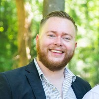

---
output:
  pagedown::html_resume:
    # set it to true for a self-contained HTML page but it'll take longer to render
    self_contained: TRUE
# uncomment this line to produce HTML and PDF in RStudio:
#knit: pagedown::chrome_print
---
 
  
Aside
====================================
  
  

Contact info 
------------------------------------
  
<i class="fa fa-envelope"></i> timcerato@gmail.com  
  
<i class="fa fa-phone"></i> (603) 305-7822

Skills 
------------------------------------
  
- <i class="fa fa-empire"></i> Something Marketing

- <i class="fa fa-resistance"></i> Did stuff

Disclaimer
------------------------------------

Main
====================================

Tim Cerato {#title}
------------------------------------

Passionate marketing technologist and Marketo Champion, with 9+ years of experience in B2B and B2C marketing. Focused on the scalable implementation of marketing technology, to facilitate unified customer experiences and data-driven marketing optimization.

Professional Experience {data-icon=briefcase}
------------------------------------

### Senior Director of Marketing Technology

Southern New Hampshire University

Manchester NH

Present - Dec 2019

:::consice
- Marketing Product Owner for CRM Transformation project (Largest Salesforce Implementation in Higher Ed)
- Lead Workstream for Migration from Marketo to Salesforce Marketing Cloud.
- Oversaw envisioning and development of lead flow architecture to best support agility and flexibility at scale, leading to a 71% improvement in speed to lead.
- Lead SNHU's Marketing Technology practice, fostering widespread adoption of new technologies.
- Architected centralized data model for campaign tracking and attribution.
- Promoted Marketing and Admissions alignment through streamlined dialer architecture allowing for more personalized student experiences.
:::

### Director of Marketing Automation / Martech Product Owner

Southern New Hampshire University

Manchester NH

Dec 2019 - Nov 2017

:::consice
- Marketing Product Owner for CRM Transformation project (Largest Salesforce Implementation in Higher Ed)
- Lead Workstream for Migration from Marketo to Salesforce Marketing Cloud.
- Oversaw envisioning and development of lead flow architecture to best support agility and flexibility at scale, leading to a 71% improvement in speed to lead.
- Lead SNHU's Marketing Technology practice, fostering widespread adoption of new technologies.
- Architected centralized data model for campaign tracking and attribution.
- Promoted Marketing and Admissions alignment through streamlined dialer architecture allowing for more personalized student experiences.
:::

### Marketing Automation Consultant

RevEngine Marketing

Boston MA

Apr 2018 - Mar 2016

:::consice
- Strategized and architected a migration from Eloqua
to Marketo
- Advised on best practices, implementations, and customizations to support ongoing business needs
- Collaborated with key stakeholders and executives to help drive the marketing strategy
- Collaborated with SFDC Administration on enhancements and to troubleshoot system issues
- Developed and implemented data quality and enrichment programs
- Assessed marketing automation users and functionality utilization to provide recommendations on how to improve
- Provided hands-on expertise to support the development and execution of multi-channel marketing campaigns
- Advised and audited best practices and trained marketing users on the platform
:::

### Marketing Automation Manager

DataGravity

Nashua NH

Nov 2018 - Apr 2018

:::consice
- Drive internal adoption of marketing automation through education
- Work with a diverse client-base to drive best practices, grow inbound lead volume and to increase funnel velocity, through the use marketing automation
- Work with key client stakeholders and executives to align marketing automation practices with the organization’s needs
- Lead architect for the development 8+ Marketo environments
- Work with fellow consultants to continuously develop and redefine best practices
- Manage up to 6 client relationships at one time
- Help clients achieve success through robust lead nurturing initiatives
- Work with clients to develop multi-channel marketing campaigns
- Strategize and develop reports to measure internal KPIs and goals
:::

Education {data-icon=graduation-cap}
------------------------------------

### Southern New Hampshire University

Bachelor of Arts in Mathematics

Manchester NH

December 2016 - September 2013

Minor in Education

- Math Club President
- Competition Team Captain

### Naval Explosive Ordnance Disposal School 

Explosive Ordnance Disposal Specialist

Destin FL

October 2008